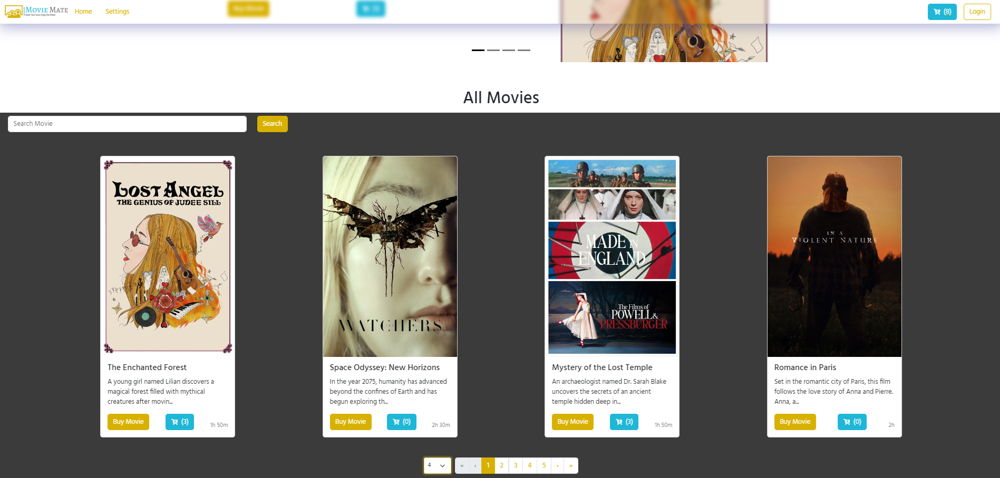
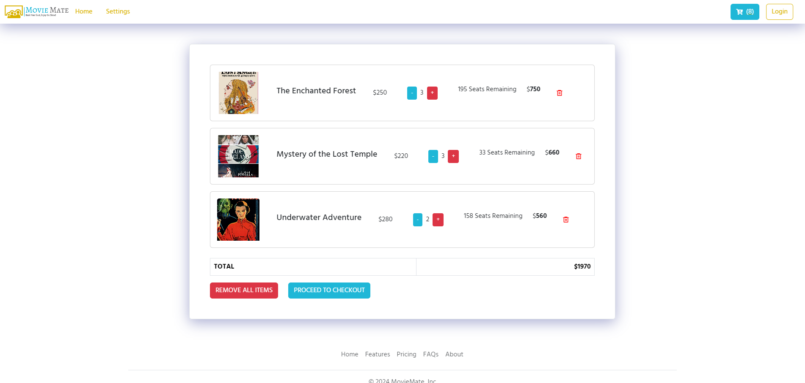
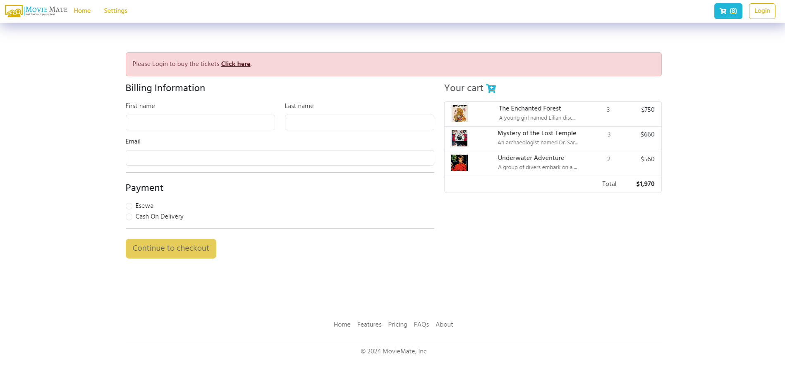

# Movie Mate Web App

- MovieMate is a web application to buy movie tickets.
- Once the user buys a ticket, a copy of the ticket order is sent via email.

## Technology

- This application is made using MERN Stack, a modern full stack development stack. The stack includes MongoDB, ExpressJS, ReactJS and NodeJS as its technology.

- The app uses React-Redux for state management.

- The backend and frontend communicates through RESTApi built using NodeJS and ExpressJS.

## App Images

### Home Page

### Cart Page

### Checkout Page

